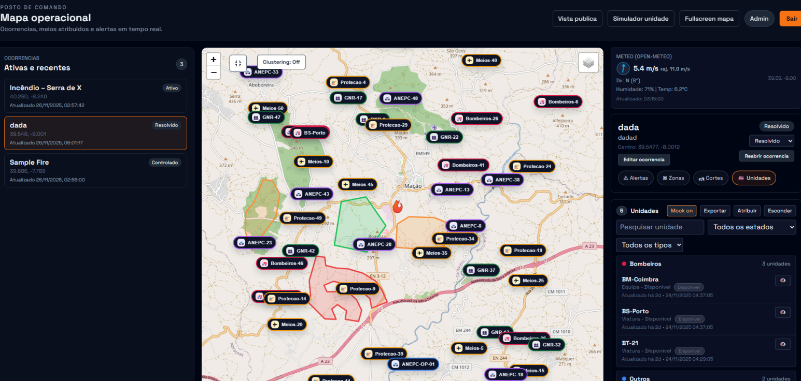

# POCI – Plataforma de Coordenação de Incêndios

POCI (Plataforma de Coordenação de Incêndios) is a Portuguese-led initiative to improve the command, coordination and public information around rural wildfires.  
It aims to provide a **Common Operating Picture** for all entities involved in the response, while also serving trusted, filtered information to the public.

> Estado atual: Prova de Conceito independente, não integrada em sistemas oficiais, em fase de apresentação e recolha de feedback técnico.

### Screenshot (MVP)

---

## Problema

Todos os anos, Portugal enfrenta incêndios rurais de grande complexidade e impacto humano, ambiental e económico. Em muitos contextos, a coordenação operacional continua dependente de:

- múltiplos sistemas não integrados  
- comunicação por rádio e telefone como principal meio de transmissão de informação  
- ausência de uma representação visual única do teatro de operações  
- dificuldade em garantir que todas as entidades partilham a mesma imagem da situação  

Isto pode originar falhas de comunicação, atrasos na decisão e riscos acrescidos para equipas e população.

---

## Finalidade

A POCI pretende:

- **Centralizar a informação operacional**, fornecendo uma imagem comum da situação a todas as entidades envolvidas no combate a incêndios rurais.
- **Disponibilizar informação filtrada e fiável à população**, sem comprometer dados sensíveis.

A plataforma foi concebida com dois níveis de utilização:

- **Vista de Comando**: informação completa, com dados sensíveis (GPS das unidades, estados operacionais, planeamento tático, etc.).
- **Vista Pública**: informação simplificada e segura, orientada para a proteção de pessoas e bens.

---

## Funcionalidades 

### Mapa operacional

- Base em OpenStreetMap com vistas Satélite e Topográfica  
- Clustering automático de marcadores  
- Marcadores adaptativos ao nível de zoom  
- Controlo de visibilidade de camadas principais:
  - incidentes
  - zonas operacionais
  - cortes de estrada
  - unidades/recursos  
- Legenda de estados e cores

### Incidentes

- Lista de incidentes ativos e recentes, com "fly‑to" imediato  
- Edição de:
  - estado do incêndio (ativo, controlado, resolvido, vigilância, etc.)
  - designação e notas
  - coordenadas do centro (incluindo seleção direta no mapa)  
- Estrutura preparada para exportação/importação de dados (futura integração com sistemas oficiais)

### Zonas operacionais

- Desenho de polígonos para:
  - zonas de exclusão
  - zonas de segurança
  - áreas de ataque/intervenção  
- Armazenamento, exportação e controlo de visibilidade  
- Codificação por tipo com cores distintas

### Cortes de estrada

- Desenho de polilinhas para cortes/condicionamentos/vias críticas  
- Estados (ativo, previsto, reaberto)  
- Listagem para coordenação com forças de segurança e entidades municipais

### Unidades, GPS e recursos

- Representação de unidades no mapa com base em coordenadas GPS (quando disponíveis)  
- Diferenciação visual por tipo:
  - Corpos de Bombeiros
  - ANEPC
  - GNR/UEPS
  - Proteção Civil Municipal
  - Meios Aéreos
  - Outros recursos  
- Filtros por tipo e estado operacional  
- Pesquisa por designação da unidade  
- Associação de unidades a incidentes  
- Função de centrar/seguir unidade  
- Modo de demonstração com "mock units"

### Alertas

- Criação e consulta de alertas associados a incidentes  
- Definição de nível de gravidade e público‑alvo  
- Preparado para futura ligação a canais externos (portais, apps, notificações, etc.)

### Meteorologia operacional

- Integração com serviços como Open‑Meteo  
- Consulta de:
  - velocidade e rajadas de vento
  - direção do vento
  - temperatura
  - humidade
  - hora da última atualização  
- Informação em cartões dedicados associados à área do incidente

### Interface

- Tema escuro, adequado a salas de operações  
- Painéis laterais recolhíveis para maximizar o mapa  
- Layout pensado para utilização clara e direta pelas equipas de comando

---

## O que a POCI procura resolver

Ao centralizar num único sistema a visualização de incidentes, unidades com localização GPS, zonas, cortes de estrada, meteorologia e alertas, a POCI pretende:

- reduzir falhas e redundâncias de comunicação  
- melhorar o tempo de perceção e compreensão da situação  
- apoiar decisões mais rápidas e fundamentadas  
- reforçar a coerência entre o que é decidido e o que é comunicado ao público  

---

## Integração de rádio e camada digital

A visão é **complementar** a comunicação por rádio, não substituí‑la:

- manter a rede rádio como eixo central de comando tático  
- registar rapidamente, na plataforma, informação operacional relevante (ordens, estados, movimentos)  
- permitir que, numa única página, se veja:
  - o que foi comunicado por rádio
  - a posição GPS das unidades
  - a evolução do incêndio, zonas e cortes
  - a informação preparada para comunicação ao público  

A POCI funciona assim como um **posto de comando digital**, alinhado com os procedimentos existentes.

---

## Alinhamento internacional

A POCI inspira‑se em exemplos internacionais de "Common Operating Picture", como:

- Sistemas estaduais australianos (EM‑COP, etc.)  
- Programas como FIRIS/Intterra na Califórnia  

Comum a estes casos:

- partilha de uma imagem única da situação  
- integração de dados de terreno, meios e meteorologia  

O objetivo é adaptar estes princípios à realidade portuguesa e à organização da Proteção Civil, Corpos de Bombeiros e Municípios.

---

## Visão de futuro

Possíveis evoluções (dependentes de orientação e interesse institucional):

- Integração com sistemas nacionais de estatística, registo de ocorrências e apoio à decisão  
- Utilização de drones e outros meios aéreos para mapeamento em tempo quase real  
- Modelos de previsão de propagação (relevo, combustível, meteorologia)  
- Apoio à definição de prioridades, meios e rotas de evacuação  
- Portal/app pública para alertas georreferenciados e recomendações oficiais  
- Módulos de análise pós‑ocorrência para formação e melhoria contínua  

---

## Estado atual

- Projeto independente em desenvolvimento  
- Prova de Conceito funcional implementada  
- Não integrada em sistemas oficiais, nem utilizada em operações reais  
- Em fase de apresentação, recolha de feedback técnico e avaliação de interesse institucional  

---

## Como contribuir / contacto

Neste momento, o foco principal é:

- recolha de parecer técnico de entidades operacionais  
- discussão de arquitetura, dados e integrações possíveis  
- identificação de parceiros institucionais e técnicos  

Se tem interesse em:

- avaliar a utilidade de uma solução deste tipo no contexto municipal ou nacional  
- colaborar tecnicamente (desenvolvimento, dados, infraestruturas)  
- partilhar experiência operacional em incêndios rurais  

entre em contacto através das **Issues** deste repositório ou do email indicado no perfil do mantenedor.

---

## Documentação completa

- **Português:** [docs/POCI.pdf](docs/POCI.pdf) (apresentação completa)
- **English:** [docs/POCI-en.md](docs/POCI-en.md) (full presentation; export to PDF with any Markdown-to-PDF tool if needed)

---

## Licença

Este projeto é disponibilizado sob a licença MIT. Consulte o ficheiro [LICENSE](LICENSE) para mais detalhes.
